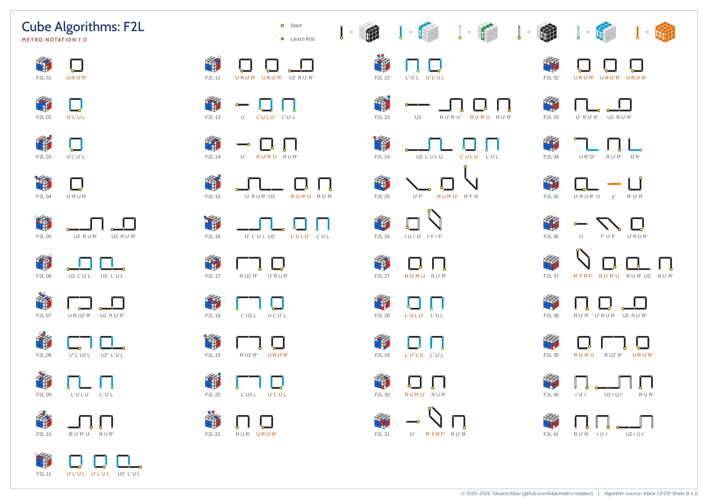
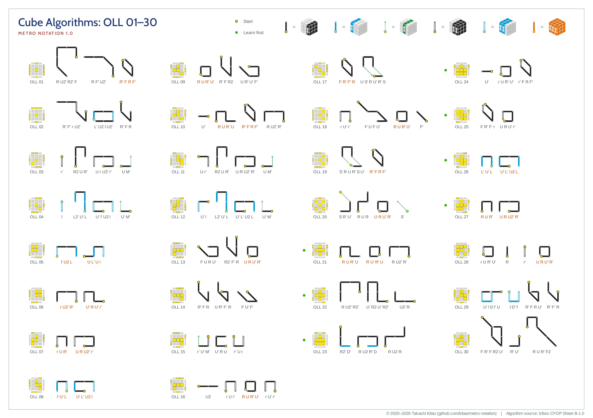
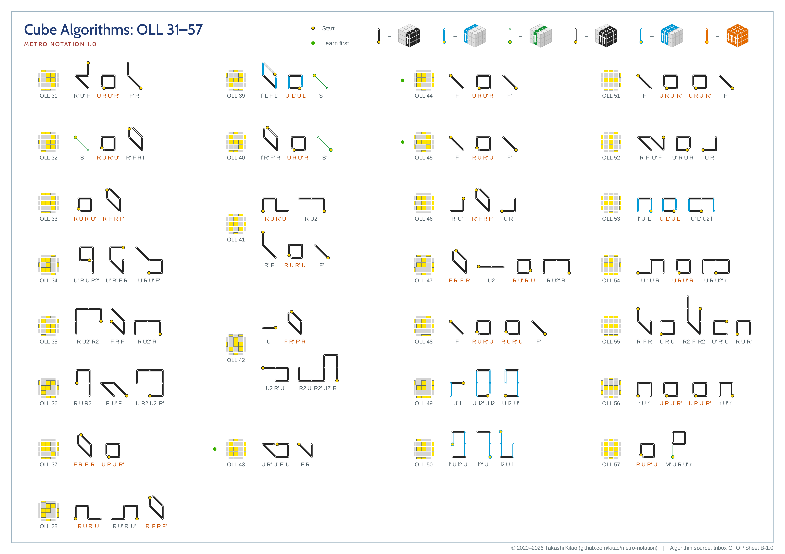
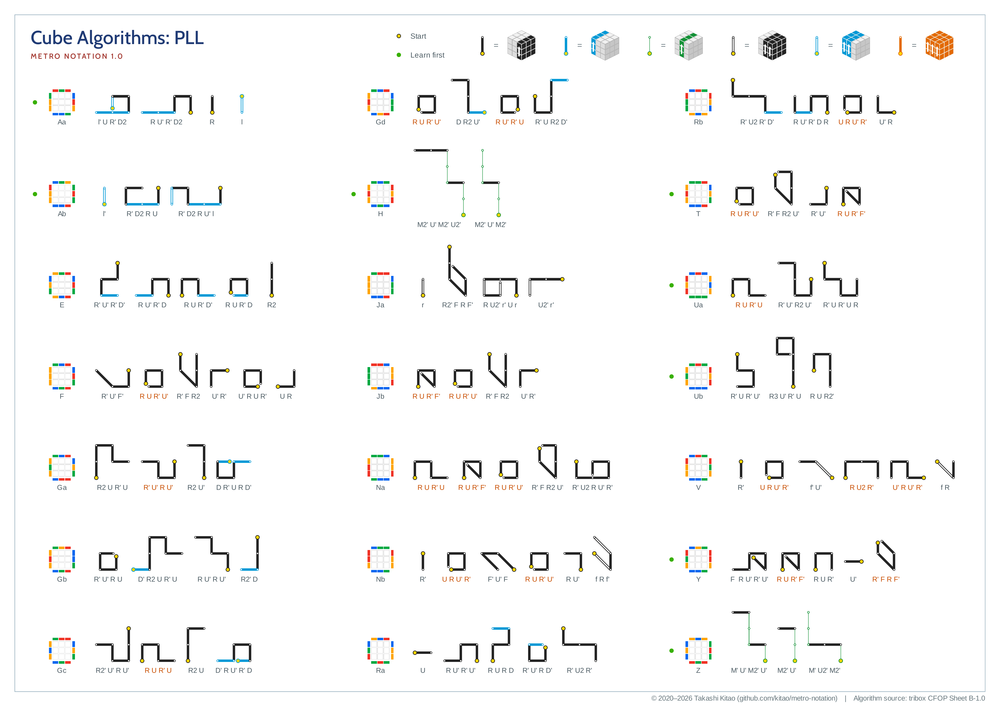

# Metro Notation

**Metro Notation** represents Rubik's Cube algorithms as metro-style diagrams. Their shapes help you remember the moves.

**路線図記法**（Metro Notation）は、ルービックキューブの回転手順を路線図のように表す記法です。図の形が、手順を覚える手がかりになります。

## PDF

[metro-notation.pdf](sheets/metro-notation.pdf)

## PNG

  
  

  
  

## Credits / クレジット

Metro Notation was created by [Takashi Kitao](https://x.com/kitao). The algorithms are from [tribox CFOP Sheet B-1.0](https://store.tribox.com/products/detail.php?product_id=3973).

路線図記法の考案者は[Takashi Kitao](https://x.com/kitao)です。回転手順は[tribox CFOP 手順表 B-1.0](https://store.tribox.com/products/detail.php?product_id=3973)から転記しています。

## License / ライセンス

The source code is licensed under the [MIT License](LICENSE). Bundled fonts use the [SIL Open Font License](src/metronotation/assets/fonts/README.md).

ソースコードは[MIT License](LICENSE)、同梱フォントは[SIL Open Font License](src/metronotation/assets/fonts/README.md)で公開しています。
