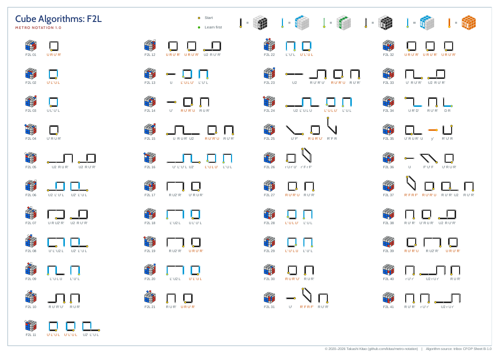
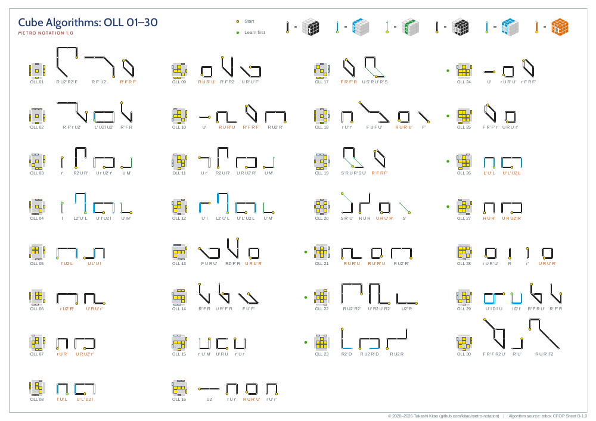
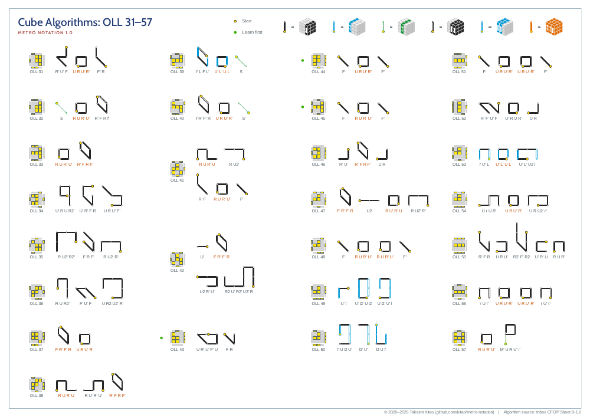
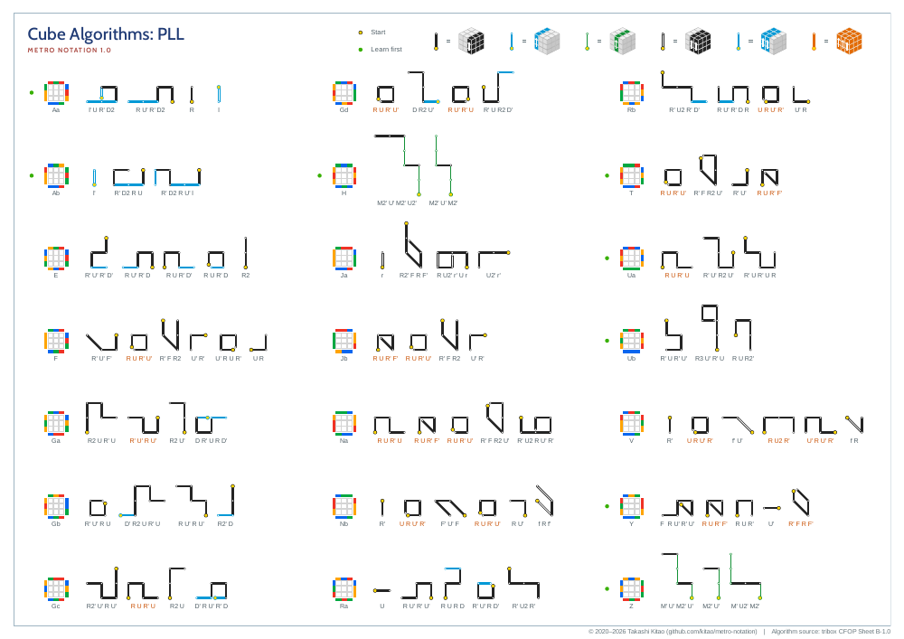

# Metro Notation

**Metro Notation** presents Rubik's Cube algorithms as metro maps to make them easier to remember.

**路線図記法**（Metro Notation）は、ルービックキューブの回し方を路線図のように描いて覚えやすくする記法です。

## PDF

[metro-notation.pdf](sheets/metro-notation.pdf)

## PNG

## Credits / クレジット

Metro Notation was created by [Takashi Kitao](https://github.com/kitao). The algorithms are from [tribox CFOP Sheet B-1.0](https://store.tribox.com/products/detail.php?product_id=3973).

路線図記法の考案者は[Takashi Kitao](https://github.com/kitao)です。回転手順は[tribox CFOP 手順表 B-1.0](https://store.tribox.com/products/detail.php?product_id=3973)から転記しています。

## License / ライセンス

The source code is licensed under the [MIT License](LICENSE). Bundled fonts use the [SIL Open Font License](metronotation/assets/fonts/README.md).

ソースコードは[MIT License](LICENSE)、同梱フォントは[SIL Open Font License](metronotation/assets/fonts/README.md)で公開しています。
