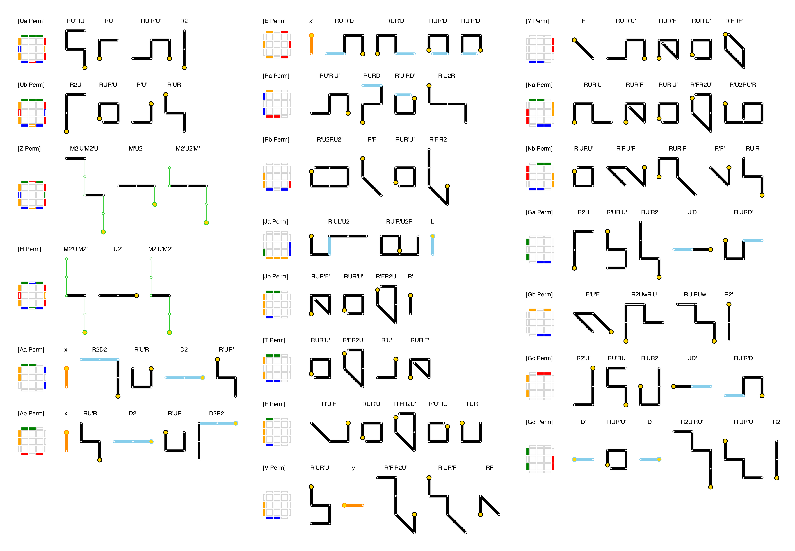

# metro-notation

Visualize the Rubik's cube algorithms in a notation like a train route map that I call **"Metro notation (メトロ記法)"**.

**"Metro notation"** focuses on the direction in which the force of each finger is applied.

## Installation

```sh
pip3 install metro-notation
```

or

```sh
pip install metro-notation
```

## Usage

```sh
metro-notation [filename]
```

## Algorithm notation format

- ``#`` ignores up to the end of the line as a comment
- ``[name]`` specifies the name of the following algorithm
- ``@``+``ROBGWYrobgwy`` describes the arrangement of the cube faces
- ``RMLUDFBw2xy'`` describes the algorithm
- ``whitespace`` splits the algorithm into triggers
- ``----`` splits the following algorithms into separate columns

```
#
# PLL algorithms
#

[Ua Perm]
@GGGRoRBrBObOwwwwwwwww
RU'RU RU RU'R'U' R2

[Z Perm]
@GrGRgRBoBObOwwwwwwwww
M2'U'M2'U' M'U2' M2'U2'M'

----

[Ra Perm]
@OwwwwwwRRBwBwwwwwwwww
RU'R'U' RURD R'U'RD' R'U2R'

[Gb Perm]
@OwOwwwBBwwwwwwwwwwwww
F'U'F R2UwR'U RU'RUw' R2'
```

## Outputs

- Standard algorithms in Metro notation ([pdf](images/metro-notation.pdf), [pptx](images/metro-notation.pptx))

### PLL Algorithms



### OLL Algorithms


